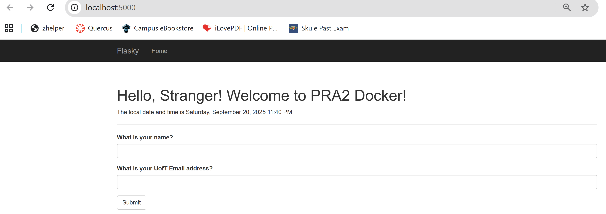
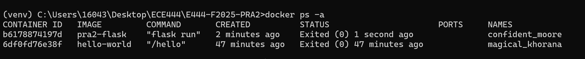

ECE444 PRA2

Name: Georgia Chen

This repo is a clone of [miguelgrinberg/flasky](https://github.com/miguelgrinberg/flasky).

## Activity 1.2

**Example 2-1, 2-2**

## Activity 1.3

**Chapter 3 Example**

## Activity 1.4

**Example 4-7**

## Activity 2.3

**Replace with Welcome to PRA2 Docker**

## Activity 2.4

**Run Docker Locally**

